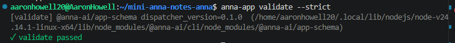
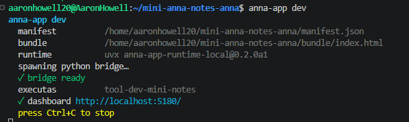
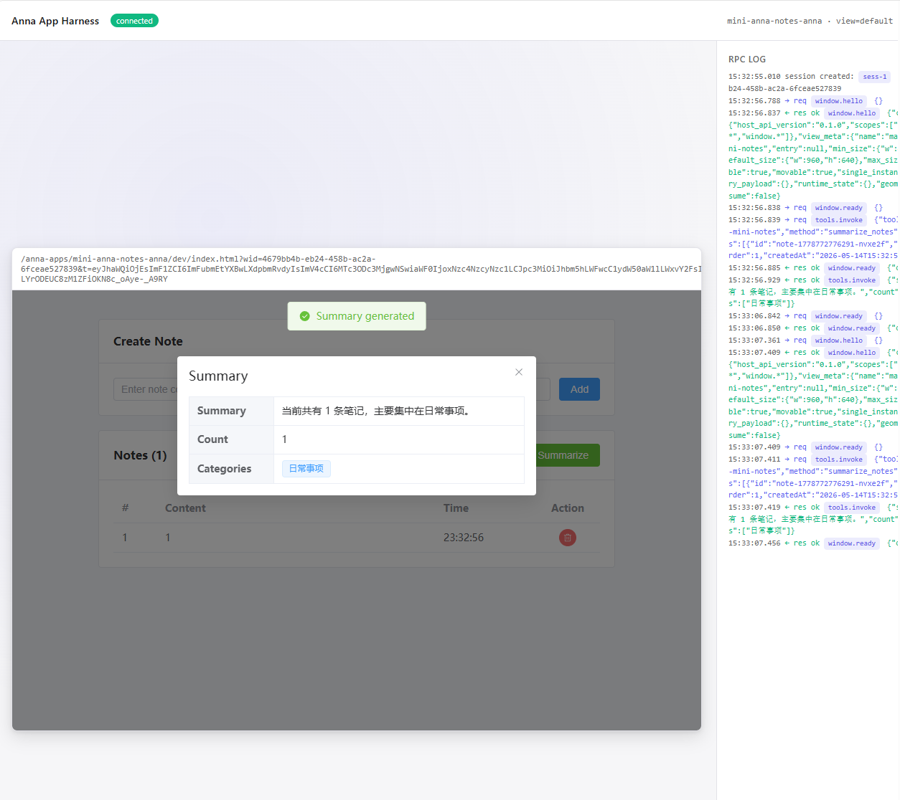

# Mini Notes

基于 Anna App 生态的笔记应用，支持笔记增删查和 AI 摘要分类。

## 依赖安装

**前端**

```bash
cd app
npm install
```

**后端**

```bash
cd executas/mini-notes
pip install -e .
# 或使用 uv：
uv sync
```

**全局工具**

```bash
npm install -g anna-app
```

## 运行

```bash
anna-app validate           # 校验配置
anna-app validate --strict  # 校验 + host_api ACL 覆盖检查
anna-app dev                # 启动开发环境
```

### 截图

**anna-app validate**



**anna-app dev**



**应用运行效果**



## 构建前端

```bash
cd app
npm run build    # vue-tsc 类型检查 + vite 构建，产物输出到 bundle/
```

## 手动测试 Executa JSON-RPC

后端插件通过 stdin/stdout 通信，可以直接用管道手动测试：

```bash
# 启动插件进程，发送 JSON-RPC 消息

# 1. 初始化
echo '{"jsonrpc":"2.0","id":1,"method":"initialize","params":{"protocolVersion":"1.1"}}' | python executas/mini-notes/mini_notes_plugin.py

# 2. 查看工具描述
echo '{"jsonrpc":"2.0","id":2,"method":"describe"}' | python executas/mini-notes/mini_notes_plugin.py

# 3. 健康检查
echo '{"jsonrpc":"2.0","id":3,"method":"health"}' | python executas/mini-notes/mini_notes_plugin.py

# 4. 调用 summarize_notes
echo '{"jsonrpc":"2.0","id":4,"method":"invoke","params":{"method":"summarize_notes","args":{"notes":[{"content":"修复登录bug"},{"content":"和产品经理沟通需求"}]}}}' | python executas/mini-notes/mini_notes_plugin.py
```

预期返回（最后一条）：

```json
{
  "jsonrpc": "2.0",
  "id": 4,
  "result": {
    "success": true,
    "tool": "summarize_notes",
    "data": {
      "summary": "当前共有 2 条笔记，主要集中在开发、协作。",
      "count": 2,
      "categories": ["开发", "协作"]
    }
  }
}
```

## bundle / manifest / executas 的关系

```
manifest.json          应用的metadata
  │
  ├─ ui.bundle ──────► bundle/              前端构建产物 SPA
  │   指定 entry:         Vite 打包后的静态文件 (HTML/CSS/JS)
  │   "index.html"        Anna App 宿主加载这个目录作为 UI
  │
  └─ required_executas ► executas/          后端工具
      注册 tool_id:        Python 插件，实现 JSON-RPC 协议
      "tool-dev-mini-notes"  宿主启动插件进程，前端通过
                            anna.tools.invoke() 调用
```

- **manifest.json**：Anna App 的核心元数据与能力声明文件，用来告诉 Anna harness 这个应用的基本信息、前端 bundle 入口、窗口配置、可调用的本地 Executa tools，以及 UI 被允许访问哪些 host API。
- **bundle/**：`npm run build` 的产物，是宿主实际加载的前端资源
- **executas/**：后端插件目录，宿主会启动其中的 Python 进程，通过 stdin/stdout 与前端通信

前端调用链路：

```
用户操作 → NoteApp.vue → annaToolClient.ts → anna.tools.invoke()
  → Anna 宿主 → stdin → mini_notes_plugin.py → stdout → 返回结果
```
